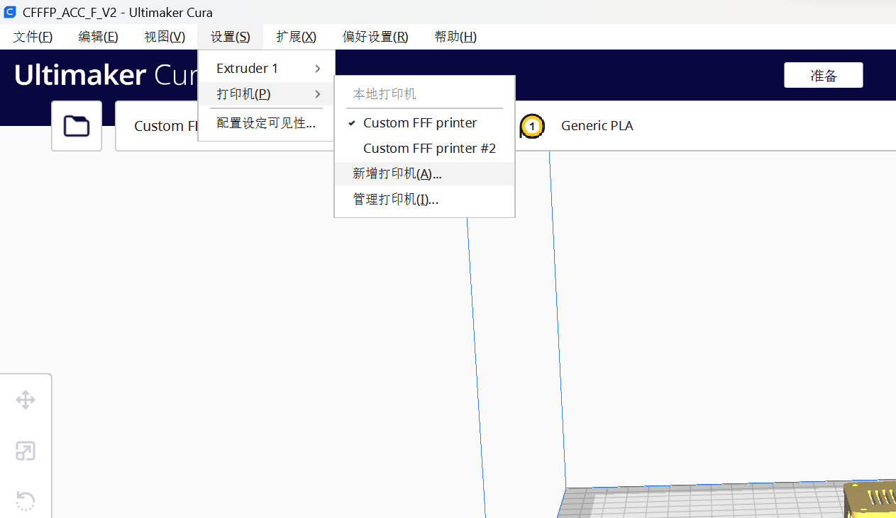
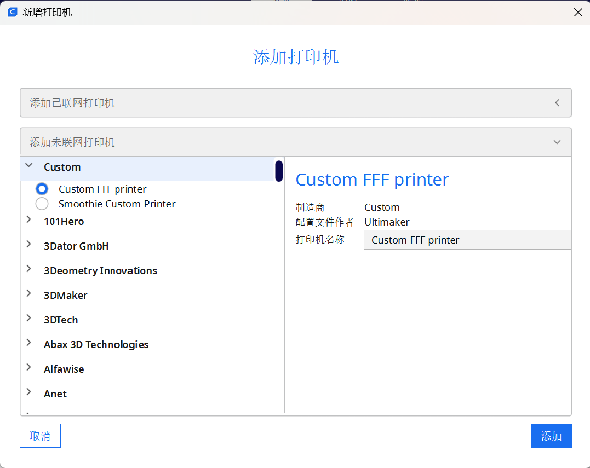
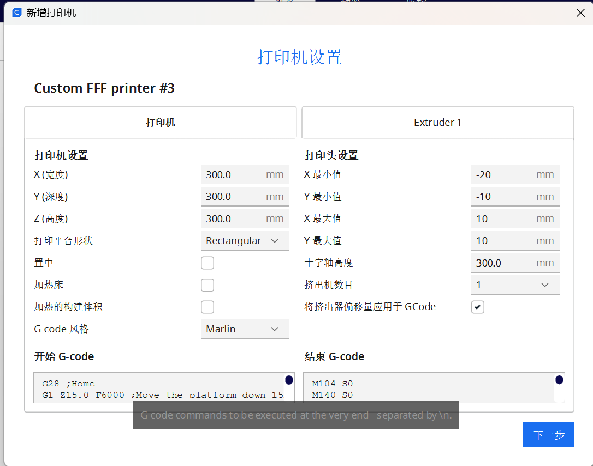
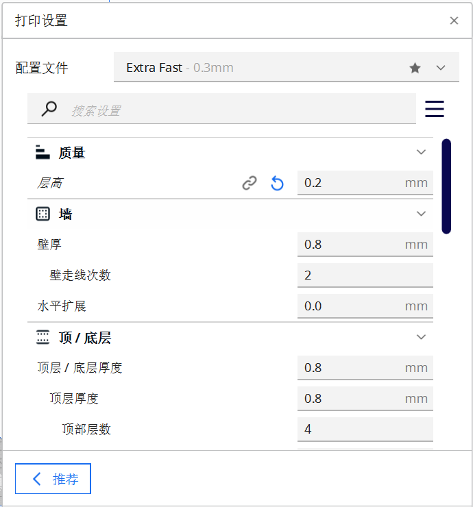

# 实验室3d打印机使用简介

说明：本篇主要介绍实验室3d打印机的使用

## 注意事项
1. 不可实验室无人情况下打印，最好有人在，出意外可以把控
2. 记得调平和设置好温度再开始打印
3. 出现异常应立即再fluidd上强制停止
4. 最后离开实验室的时候记得打印机也得断电，把开关关闭即可

## 软件说明

主要会使用到两个软件，360fusion、cura和一个平台fluidd

### 360fusion

下载说明：官网下载使用教育版免费使用

功能说明：其是一款建模软件，有一些常用的使用设置和说明这里不展开赘述，想要深入学习上b站大学自学，会建一些基础的结构件即可

平面画图，会拉伸，布尔运算等差不多了

### cura

下载说明：官网下载免费软件，正常下载完是英文在tools中找到language改成中文即可方便使用

功能说明：其是是一款切片软件会使用即可，主要是一些打印机的参数设计，详情见下图

1. 新增自己的打印机

2. 在custom中找到custom FFF printer

3. 主要将x、y、z三个参数设置成下图所示即可，其余均可不动

4. 常用参数设置说明

· 层高正常结构件为0.3，影响打印速度和精度

· 打印速度最快120，影响打印速度和精度

· 填充如果为结构件则为100%，影响打印件的牢固性

· 打印温度200，不用改

· 支撑的选择和密度，有镂空的支撑必选，密度在10~20%左右，最好小于打印件自身密度

### fluidd

下载说明：无需下载在线使用的平台，网址192.168.1.100

功能说明：（图片后补充）
1. 开始使用前，需要调平和设置平台温度为70~80℃左右
2. 在任务栏中开始任务即可等待打印件完成

## 硬件说明
待补充

