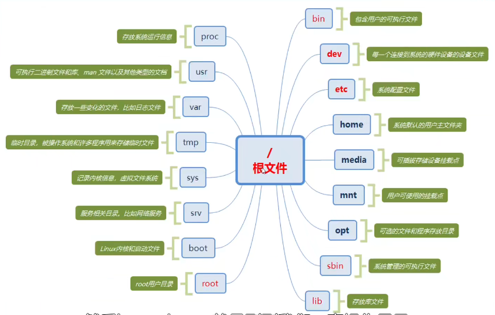

# 简单介绍智能车
1. A类51循迹小车。  
2. B类有上位机如树莓派或者jeston nano这类板载来驱动底层下位机32或者51的小车，但实现功能还是以A类小车相似。  
3. C类 个人认为是真正意义上的智能车，包含上位机和下位机，上位机能够搭载如激光雷达，双目摄像头等外设，完成slam自主导航的功能。

# 简单介绍一下linux和ros及slam技术
## ros
ros全称Robot Operating System，机器人操作系统，不是传统意义上的操作系统，像Linux、Windows、Android这类系统。

## Linux
Linux 好用开放性高的操作系统，因为不是本文章重点，就不过多展开介绍。~~不是因为讲不清偷懒不讲了~~

## slam
slam (simultaneous localization and mapping),也称为CML (Concurrent Mapping and Localization), 即时定位与地图构建，或并发建图与定位。~~具体的原理也不太熟就不展开讲述，以免误人子弟~~

# unbuntu系统安装
网上相关文章一抓一大把，多装就会了，本文章还是更多以教会使用为主

# shell和常用命令
shell是用户和Linux的一个桥梁

其中Ubuntu中的shell是bash

```bash
sudo chmod +x name
#给文件增加执行权限

vim name
#编辑文件

$ test=123
$ echo $test
# 增加变量和输出变量名
```
具体更多的运用还得深入学习

# Ubuntu中安装和卸载应用
1. 常规使用图形画界面安装和卸载东西，就不多介绍
2. 主要强调使用apt来安装

```bash
sudo apt update
#更新一下这个apt，sudo给与管理者权限
sudo apt install tree
#安装一个tree来查看文件放置的应用
```
# vim编译器
```bash
vim name
#进入编辑文件模式
#在编辑状态下使用dd删除整行
#使用:w改写,:wq改写并保存;:q!强制退出
#在编辑模式下按下i进入插入模式，home键到行首，end到行尾
```
常用的就这些，感觉

# 简单介绍一下Linux文件管理



看图，最好背下来，背不下来就多看多记，然后就背下来了

# 文件权限

增添文件权限
```bash
sudo chmod +x name
#自行了解可读可写类型和修改
su 
#进入root用户
exit
#退出
```
# Ubuntu下安装ros

不同Ubuntu需要安装不同版本的ros

可以进入到官方wiki下跟着安装步骤走
Wiki中文版[wiki.ros.org](http://wiki.ros.org/cn)

# 通信方式

话题、订阅、动作、参数

# ros常用shell命令

```bash
 roscd turtlesim/
 #可以直接跳转到文件下
 roscore
 #启动一个master
 rosrun name
 
 rosnode
 rosnode info
 rosnode keill name
 rosnode machine 
 rostopic info name
 rostopoc echo


```


# ros坐标系和tf变换


